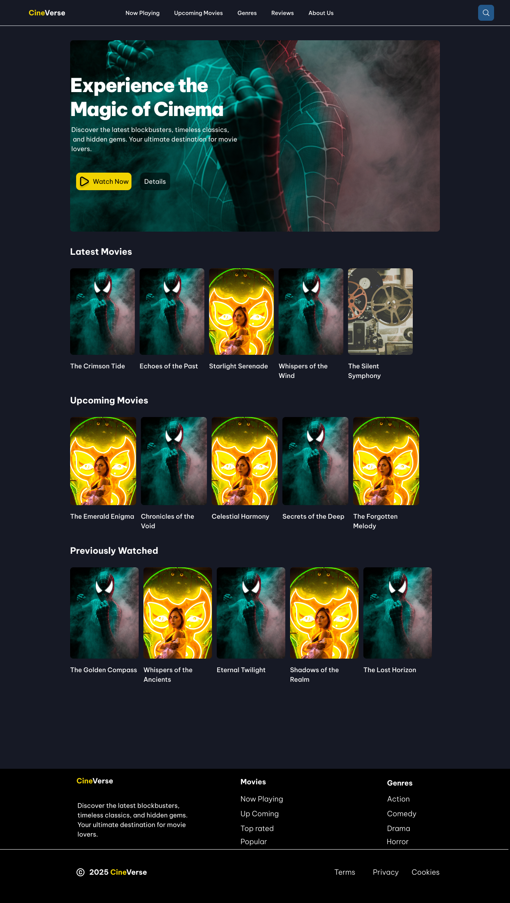

# MovieVerse

MovieVerse is a modern React application for discovering movies, exploring genres, and reading reviews. Powered by the [TMDb API](https://www.themoviedb.org/documentation/api), it features a clean UI, search functionality, and responsive design with Tailwind CSS.



## Features

- 🔍 **Search** for movies by title
- 🎬 Browse **Popular**,  and **Upcoming Movies**
- 🎭 Explore by **Genres**
- 📝 Read **Movie Details**
- Responsive layout and modern design

## Getting Started

### Prerequisites

- [Node.js](https://nodejs.org/) (v16+ recommended)
- [npm](https://www.npmjs.com/)

### Installation

1. **Clone the repository:**

   ```sh
   git clone https://github.com/yourusername/movie-verse.git
   cd movie-verse
   ```

2. **Install dependencies:**

   ```sh
   npm install
   ```

3. **Set up environment variables:**

   Create a `.env` file in the root directory with the following content:

   ```
   VITE_TMDB_API_KEY=your_tmdb_api_key
   ```

   Replace `your_tmdb_api_key` with your [TMDb API key](https://www.themoviedb.org/settings/api).

4. **Start the development server:**

   ```sh
   npm run dev
   ```

   The app will be available at [http://localhost:5173](http://localhost:5173) (or as indicated in your terminal).

## Project Structure

- `src/components/` – React components (UI, layout)
- `src/pages/` – Page components (Home, Genres, Details, etc.)
- `src/store/` – Zustand stores for state management
- `src/utils/` – API utilities and constants
- `src/assets/` – Static assets
- `public/` – Public files (e.g., favicon)
- `Desktop-theme.png` – Desktop UI preview

## Tech Stack

- [React](https://react.dev/)
- [Vite](https://vitejs.dev/)
- [Tailwind CSS](https://tailwindcss.com/)
- [Zustand](https://zustand-demo.pmnd.rs/)
- [React Router](https://reactrouter.com/)
- [TMDb API](https://www.themoviedb.org/documentation/api)

## License

This project is licensed under the MIT License.

---

**Desktop Preview:**


